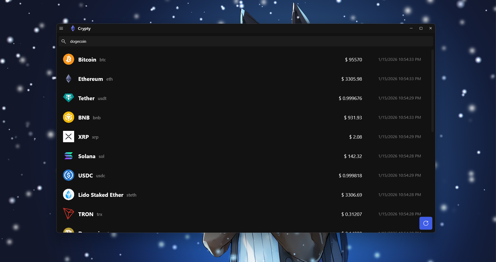
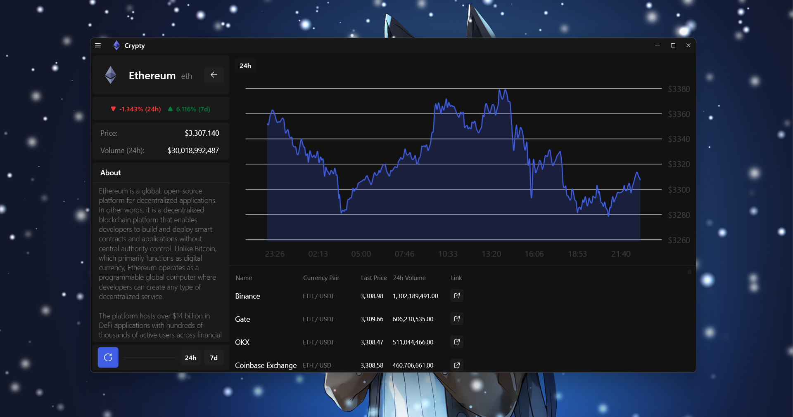
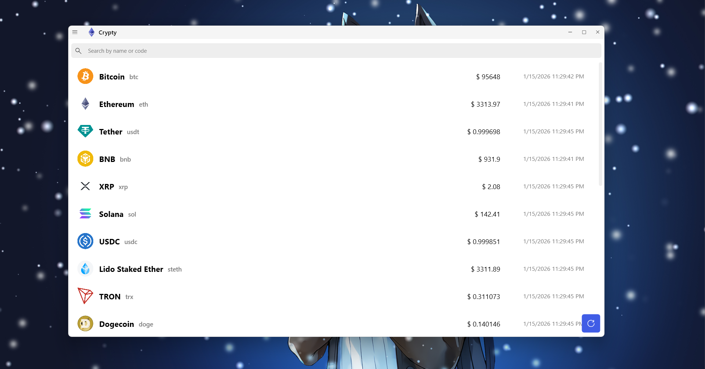

# Project "Crypty" - summary

## What was done

Project was implemented using WPF .NET Core, C# with MVVM.

As API for crypto-currency information was used **CoinGecko**: https://www.coingecko.com/en/api/documentation

### Important
*API key for data provider must be set in the code of **ConfigurationService.cs** file (default config template), or in the **appConfig.json** in root directory after first start up.*

### Functionality what was implemented:

* Multi-paging with navigation;
* Displaying the list of 20 (for now) crypto-currencies on the main page;
* Provided ability to view detailed information about selected currency on the corresponding page, displayed the following info:
    
    * Icon, Name, Symbol;
    * Price change (24h, 7d) percentage;
    * **Current price** and **volume in last 24 hours**;
    * Coin's **description** if available;
    * Tickers (markets) list with the following info per each ticker: name, currency pair, last traded price, volume (24h) and **link**;
    * Line chart with info for the last 24 hours and 7 days;

* Implemented way to search for specified currency by its name or symbol (only among loaded);
* Dark / Light themes supported;

### Main page with crypto-currency list

### Coin page, with details

### Main page with crypto-currency list (Light theme)

### Coin page, with details (Light theme)

